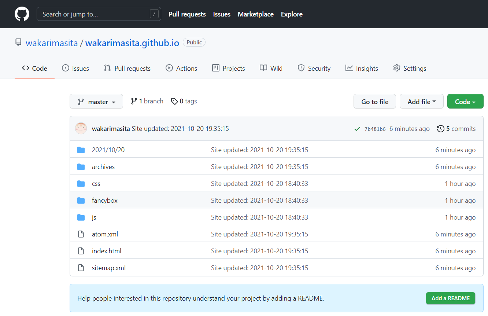

## 前言
今天突然产生了极大的个人博客搭建的热情，查询了wordpress没弄明白后从网上的教程里找到了如今的配置，遂记录一波   
早就听说了github page的方便之处，但当时在钻[私人服务器](http://60.205.226.43)和[私人域名](http://haitang.cafe)的牛角尖，内心里一直没有接受这个东西，但实际尝试之后发现还是香啊。
***
## Reference

- 为什么用Reference不用参考文献呢？因为感觉参考文献这个词好奇怪啊   
- 为什么要把Reference写在最前面呢，因为这个页面应该只有我自己看，而自己看的目的基本也就是找当时在哪里找的教程，遂如此

1. [ubuntu下搭建Hexo+GitHub博客](https://www.jianshu.com/p/9b2f2de68838)
2. [怎么在Ubuntu服务器上部署Hexo博客](https://www.yisu.com/zixun/556831.html)
3. [Ubuntu 安装最新版nodejs](https://www.cnblogs.com/feiquan/p/11223487.html#:~:text=Ubuntu%20%E5%AE%89%E8%A3%85%E6%9C%80%E6%96%B0%E7%89%88nodejs.%20%E8%BD%AC%E8%87%AA%EF%BC%9Aubuntu%E5%BF%AB%E9%80%9F%E5%AE%89%E8%A3%85%E6%9C%80%E6%96%B0%E7%89%88nodejs%EF%BC%8C%E5%8F%AA%E9%9C%802%E6%AD%A5.%20%E7%AC%AC%E4%B8%80%E6%AD%A5%EF%BC%8C%E5%8E%BB%20nodejs%20%E5%AE%98%E7%BD%91%20https%3A%2F%2Fnodejs.org%20%E7%9C%8B%E6%9C%80%E6%96%B0%E7%9A%84%E7%89%88%E6%9C%AC%E5%8F%B7%EF%BC%9B.,%E6%98%AF%E6%9C%80%E6%96%B0%E7%9A%84%E7%89%88%E6%9C%AC%EF%BC%8C%E4%B8%8D%E8%BF%87%E4%BD%A0%E6%B1%82%E7%A8%B3%E7%9A%84%E8%AF%9D%E5%BB%BA%E8%AE%AE%E9%80%89%2010.16.0%20%E7%9A%84LTS%E7%89%88%E3%80%82.%20%E7%AC%AC%E4%BA%8C%E6%AD%A5%EF%BC%8C%E6%B7%BB%E5%8A%A0%E6%BA%90%E5%90%8E%E5%AE%89%E8%A3%85.%20%E9%87%8D%E7%82%B9%E6%9D%A5%E4%BA%86%EF%BC%8Cnodejs%20%E7%9A%84%E6%AF%8F%E4%B8%AA%E5%A4%A7%E7%89%88%E6%9C%AC%E5%8F%B7%E9%83%BD%E6%9C%89%E7%9B%B8%E5%AF%B9%E5%BA%94%E7%9A%84%E6%BA%90%EF%BC%8C%E6%AF%94%E5%A6%82%E8%BF%99%E9%87%8C%E7%9A%84%2010.x.x%E7%89%88%E6%9C%AC%E7%9A%84%E6%BA%90%E6%98%AFhttps%3A%2F%2Fdeb.nodesource.com%2Fsetup_10.x%E3%80%82.%20%E6%89%80%E4%BB%A5%E5%9C%A8%E7%BB%88%E7%AB%AF%E6%89%A7%E8%A1%8C%EF%BC%9A.)
4. [指令|Hexo](https://hexo.io/zh-cn/docs/commands)
5. [hexo 本地编辑md文件_使用hexo新建、编辑并预览文章](https://blog.csdn.net/weixin_39636333/article/details/110638794)
6. [hexo模板-icarus](https://github.com/ppoffice/hexo-theme-icarus)
7. [Icarus快速上手](http://ppoffice.github.io/hexo-theme-icarus/uncategorized/icarus%E5%BF%AB%E9%80%9F%E4%B8%8A%E6%89%8B/)
6. [hexo g报错,line.mathALL is not funciton问题解决](https://blog.csdn.net/baidu_20313315/article/details/118384409) *这个是痛苦报错的雪中炭*
7. [npm WARN optional SKIPPING OPTIONAL DEPENDENCY: fsevents@2.1.2 (node_modules\fsevents):](https://blog.csdn.net/m0_46256147/article/details/104725439) *这个也是，但没有用到*
***
## 操作环境
Ubuntu 20.04
## 环境配置
### 一、安装npm
```bash
sudo apt-get install npm
```
### 二、安装Node.js
1. 添加最新版Node.js源
```bash
curl -sL https://deb.nodesource.com/setup_12.x | sudo -E bash -
```
2. 安装Node.js
```bash
sudo apt-get install -y nodejs
```
3. 验证安装
```bash
nodejs -v
```
如果直接使用 `apt-get install nodejs`的话安装版本为10.16.0，在使用hexo时会出现方法不存在的问题。
### 三、安装Hexo
```bash
#创建目录
mkdir hexo
#进入目录
cd hexo
#安装hexo
sudo npm install -g hexo-cli
sudo npm install -g hexo-server
#初始化仓库
hexo init
```
测试安装成功
```bash
hexo server
```
***
## github Pages配置
ssh连接github的教程有很多，这里就不赘余了
1. 在自己的github里创建名为 **<用户名>.github.io**的仓库(可以使用其他名称如hello.io，但这样做的好处是可以直接使用https://<用户名>.github.io访问此网站)   

***
## 配置hexo/_config.yml
1. 站点信息设置
```
title: TJhaitang's Blog #站名
subtitle: flame! #副标题
description: #站描述
author: #作者
language: zh-CN #语言
timezone:
```
2. 配置url
```
url: http://TJhaitang.github.io
root: /
permalink: :year/:month/:day/:title/
permalink_defaults:
```
3. 默认创建资源文件夹
```
yaml post_asset_folder: true
```
4. 资源仓库
```
deploy:
type: git
repo: git@github.com:TJhaitang/TJhaitang.github.io.git #TJhaitang是你的用户名
branch: master
```
***
## Hexo基础命令
```bash
hexo n "文章标题" #会在 hexo/source/_post 下生成对应的.md文件
hexo g #生成静态文件，即编译当前的网站
hexo d #提交部署
```
***
## Hexo模板配置
以后再写，总的来说就是上面reference里面的那个


